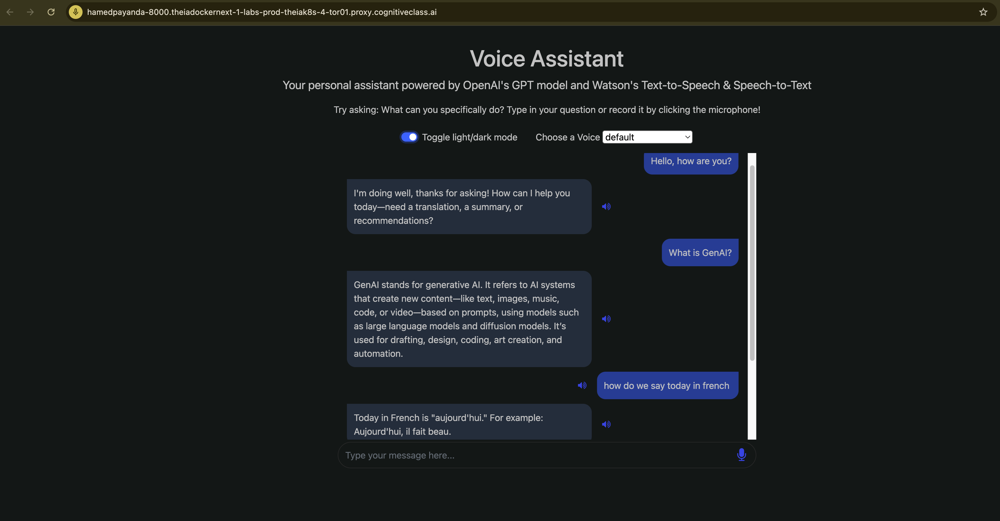
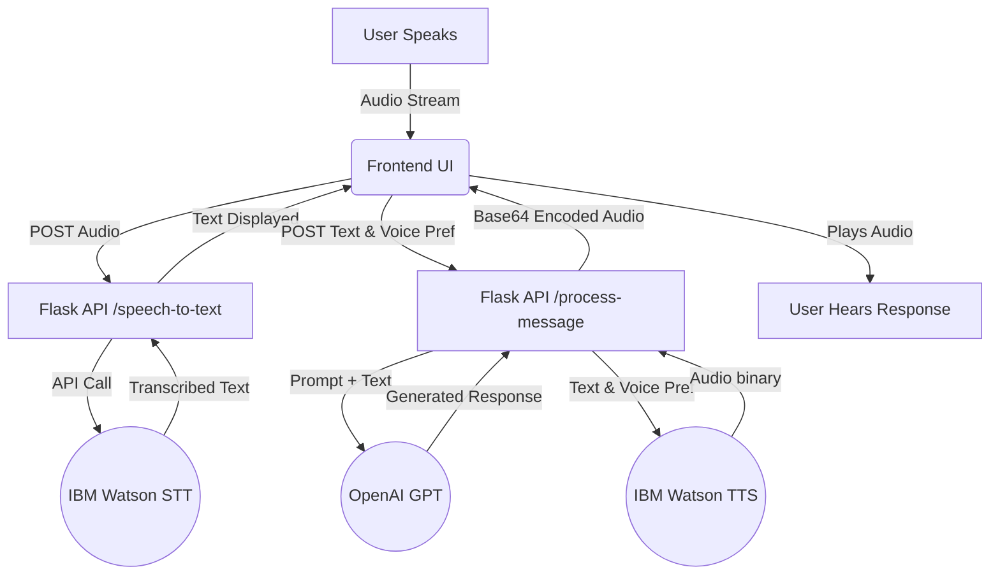

# 🎙️ AI Voice Assistant: Watson & OpenAI Integration


## 📖 Project Overview
A full-stack, AI-powered virtual assistant that seamlessy bridges human speech and large language models. This application captures user audio, converts it to text using IBM Watson's Speech-to-Text, processes the input through OpenAI's GPT for intelligent conversational responses, and synthesizes the AI's reply back into natural human speech using Watson's Text-to-Speech capabilities. 

## 📸 The Visual Proof


---

## ✨ Key Features
* **Bi-directional Voice Communication:** Talk directly to the AI and listen to its spoken responses.
* **Intelligent Processing:** Leverages OpenAI GPT models for contextual, accurate, and concise answers, translations, and summaries.
* **Multilingual Voice Support:** Dynamically swap between different Watson TTS voice profiles and accents.
* **Responsive UI:** Clean, modern frontend interface featuring dark/light mode and real-time chat history.
* **Fully Containerized:** Pre-configured Docker environment for instant, reliable deployment across any system.

---

## 🛠️ Core Tech Stack

| Component | Technology | Purpose |
| :--- | :--- | :--- |
| **Backend Framework** | Flask (Python) | API routing, HTTP request handling, and server logic. |
| **AI Brain** | OpenAI API | Natural Language Processing (NLP) and response generation. |
| **Speech-to-Text (STT)** | IBM Watson | Transcribing binary audio data into text strings. |
| **Text-to-Speech (TTS)** | IBM Watson | Synthesizing generated text back into `.wav` audio files. |
| **Frontend UI** | HTML5, CSS3, JS, jQuery | Client-side interface, microphone recording, and base64 audio decoding. |
| **Infrastructure** | Docker | Environment containerization and dependency management. |

---

## 🏗️ Architecture Diagram


## 📂 Repository Structure
```text
📦 watson-openai-voice-assistant
 ┣ 📂 certs/              # SSL/CA certificates for secure API communication
 ┣ 📂 models/             # Local data models
 ┣ 📂 static/             # Frontend assets
 ┃ ┣ 📜 script.js         # UI logic, audio recording, and API fetch calls
 ┃ ┗ 📜 style.css         # Styling and UI animations
 ┣ 📂 templates/          # HTML templates
 ┃ ┗ 📜 index.html        # Main application interface
 ┣ 📜 .gitignore          # Ignored files for version control
 ┣ 📜 Dockerfile          # Container build instructions
 ┣ 📜 LICENSE             # MIT License
 ┣ 📜 README.md           # Project documentation
 ┣ 📜 demo3.png           # UI screenshot
 ┣ 📜 requirements.txt    # Python package dependencies
 ┣ 📜 server.py           # Flask application and route definitions
 ┗ 📜 worker.py           # Core logic for OpenAI and Watson API integrations
```
## 💻 Local Setup & Execution
1. Clone the repository
```bash
git clone [https://github.com/HAMED-PAYANDA/watson-openai-voice-assistant.git](https://github.com/HAMED-PAYANDA/watson-openai-voice-assistant.git)
cd watson-openai-voice-assistant
```
2. Setup Certificates (If required by your environment)
```bash
mkdir -p certs
cp /usr/local/share/ca-certificates/rootCA.crt certs/
```
3. Build the Docker Image
```bash
docker build . -t voice-chatapp-powered-by-openai
```
4. Run the Container
```bash
docker run -p 8000:8000 voice-chatapp-powered-by-openai
```
5. Access the Application
Open your web browser and navigate to http://localhost:8000. Ensure you grant the browser permission to access your microphone!

## 🧠 Code Highlight: The Orchestration Logic
This block demonstrates how the Flask backend acts as the orchestrator, passing data seamlessly between OpenAI and IBM Watson.
```python
@app.route('/process-message', methods=['POST'])
def process_message_route():
    user_message = request.json['userMessage'] 
    voice = request.json['voice'] 

    # 1. Process prompt via OpenAI
    openai_response_text = openai_process_message(user_message)
    openai_response_text = os.linesep.join([s for s in openai_response_text.splitlines() if s])

    # 2. Synthesize audio via Watson TTS
    openai_response_speech = text_to_speech(openai_response_text, voice)

    # 3. Encode audio to Base64 for JSON transmission
    openai_response_speech = base64.b64encode(openai_response_speech).decode('utf-8')

    # 4. Return dual payload to frontend
    response = app.response_class(
        response=json.dumps({
            "openaiResponseText": openai_response_text, 
            "openaiResponseSpeech": openai_response_speech
        }),
        status=200,
        mimetype='application/json'
    )
    return response
```
👨‍💻 Author
Hamed Payanda
•	GitHub: @HAMED-PAYANDA
Completed as part of the IBM AI Developer program.

